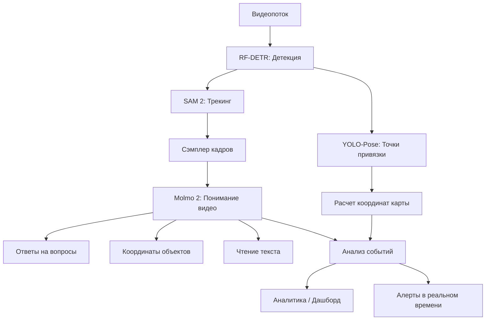

# Эталонная Архитектура Мультимодальной AI-системы

Данный документ описывает целевую архитектуру (Target Architecture) нашего проекта, основанную на лучших практиках построения сложных CV-пайплайнов. Мы стремимся к реализации модульного подхода с интеграцией SOTA vision-language моделей.

## Философия Архитектуры

**Гибридный подход**: Быстрые специализированные детекторы + мощная VLM для семантического понимания.

```
┌─────────────────────────────────────────────────────────────────┐
│                     АРХИТЕКТУРА СИСТЕМЫ                         │
├─────────────────────────────────────────────────────────────────┤
│                                                                 │
│   Видеопоток                                                    │
│       │                                                         │
│       ▼                                                         │
│   ┌───────────────┐                                             │
│   │   RF-DETR     │  ← Быстрая детекция (real-time)            │
│   │   (Detection) │                                             │
│   └───────┬───────┘                                             │
│           │                                                     │
│           ▼                                                     │
│   ┌───────────────┐                                             │
│   │    SAM 2      │  ← Точный трекинг и сегментация            │
│   │  (Tracking)   │                                             │
│   └───────┬───────┘                                             │
│           │                                                     │
│           ▼                                                     │
│   ┌───────────────┐                                             │
│   │   Molmo 2     │  ← Семантическое понимание видео           │
│   │    (VLM)      │    (Re-ID, OCR, Events, QA)                │
│   └───────┬───────┘                                             │
│           │                                                     │
│           ▼                                                     │
│   ┌───────────────┐                                             │
│   │   Dashboard   │  ← Аналитика и алерты                      │
│   └───────────────┘                                             │
│                                                                 │
└─────────────────────────────────────────────────────────────────┘
```

**Принципы**:
*   **Best-in-Class**: Лучший инструмент для каждой задачи.
*   **Гибкость**: Возможность замены компонентов без переписывания всего пайплайна.
*   **Открытость**: Только open-source модели с прозрачными лицензиями.

## Компоненты Пайплайна

### 1. Обнаружение объектов (Detection)
*   **Задача**: Идентификация ключевых объектов (персонал, техника, грузы) и событий.
*   **Технология**: **RF-DETR** (Real-Time DEtection TRansformer).
*   **Почему**: Превосходит YOLOv8/v11 по точности и устойчивости к сложному фону (DINOv2 backbone).
*   **Вход**: Кадр видео.
*   **Выход**: Bounding Boxes + Классы.

### 2. Отслеживание (Tracking & Segmentation)
*   **Задача**: Устойчивое ведение объектов при перекрытиях (окклюзиях) и сложных траекториях.
*   **Технология**: **SAM 2** (Segment Anything Model 2).
*   **Подход**: Использование детекций от RF-DETR как "промптов" для SAM 2.
*   **Преимущество**: Попиксельное отслеживание (эмбеддинги), устойчивость к исчезновению объекта из кадра.

### 3. Семантическое понимание видео (VLM)
*   **Задача**: Ответы на сложные вопросы по видео, grounding, трекинг событий.
*   **Технология**: **Molmo 2** (Allen Institute for AI).
*   **Почему Molmo 2**:
    - Открытая модель с прозрачной лицензией (можно дообучать)
    - Размеры 4B/8B реалистичны для on-prem (RTX 5090 справится)
    - Grounded понимание: возвращает координаты и таймкоды, а не только текст
    - Превосходит проприетарные модели по ряду видео-бенчмарков
*   **Возможности**:
    - **Video QA**: "Когда человек без жилета вошёл в зону?"
    - **Pointing**: "Где находится топливозаправщик?" → координаты
    - **Tracking**: Отслеживание объектов по кадрам с таймкодами
    - **Counting**: "Сколько раз техника пересекла линию?"
    - **OCR**: Чтение бортовых номеров, ID-карт, надписей
*   **Варианты моделей**:
    | Модель | Размер | База | Примечание |
    |--------|--------|------|------------|
    | Molmo-2-4B | 4B | Qwen 3 | Быстрый, для real-time |
    | Molmo-2-8B | 8B | Qwen 3 | Баланс скорость/качество |
    | Molmo-2-O-7B | 7B | OLMo | Полностью открытая база |
*   **Ресурсы**:
    - Сайт: https://allenai.org/molmo
    - Блог: https://allenai.org/blog/molmo2
    - HuggingFace: модели доступны через аккаунт Ai2
    - Playground: веб-демо для тестирования

### 4. Гео-привязка (Homography)
*   **Задача**: Перенос координат с 2D-видео на 2D-карту (схему перрона/площадки).
*   **Технология**: Кастомная **YOLOv8-Pose** (Keypoints).
*   **Метод**: Детекция реперных точек (разметка) → Расчет матрицы гомографии → Проекция.

### 5. Анализ событий (Event Logic)
*   **Задача**: Определение сложных действий (например, "начало обслуживания", "нарушение зоны").
*   **Технология**: Гибридный подход:
    - **Molmo 2** для семантических запросов ("что произошло?")
    - **FSM** (Finite State Machine) для детерминированных правил
*   **Метод**: Комбинация VLM-ответов и логики на основе детекций.

## Схема Потока Данных



## Интеграция Molmo 2 в пайплайн

### Сценарий 1: Real-time алерты
```
RF-DETR (каждый кадр) → триггер (человек в зоне) → 
    → сэмпл 10 кадров → Molmo 2 ("есть ли жилет?") → алерт
```

### Сценарий 2: Пост-анализ видео
```
Видеозапись → Molmo 2 ("найди все нарушения регламента") → 
    → список событий с таймкодами и координатами
```

### Сценарий 3: Интерактивный поиск
```
Оператор: "Когда топливозаправщик подъехал к борту?" →
    → Molmo 2 → таймкод + кадр с pointing
```

## Текущий Статус Реализации

| Компонент | Статус | Инструмент в проекте |
| :--- | :--- | :--- |
| **Detection** | ✅ Готово | `src/inference/rf_detr.py` |
| **Tracking** | ⚠️ Частично | `src/inference/sam2_demo.py` (нужен видео-пайплайн) |
| **VLM (Molmo 2)** | 🔜 Следующий этап | - |
| **Homography** | ❌ Планируется | - |
| **Events** | ❌ Планируется | - |
| **Dashboard** | ❌ Планируется | - |

## Roadmap интеграции Molmo 2

### Этап 1: Базовая интеграция
- [ ] Скачать Molmo-2-4B с HuggingFace
- [ ] Создать `src/inference/molmo2.py` — обёртка для инференса
- [ ] Тест на статичных изображениях (pointing, QA)

### Этап 2: Видео-пайплайн
- [ ] Интеграция с SAM 2 (передача треков как контекст)
- [ ] Сэмплирование кадров для VLM (не каждый кадр — дорого)
- [ ] Кэширование эмбеддингов видео

### Этап 3: Продакшн
- [ ] FastAPI/gRPC микросервис для Molmo 2
- [ ] Интеграция с очередью событий (Kafka/Redis)
- [ ] Дообучение на доменных данных (авиатехника, форма персонала)

## Требования к железу

| Модель | VRAM | Скорость (RTX 5090) |
|--------|------|---------------------|
| Molmo-2-4B | ~10 ГБ | ~2-3 сек/запрос |
| Molmo-2-8B | ~18 ГБ | ~4-5 сек/запрос |
| RF-DETR + SAM 2 + Molmo-2-4B | ~20 ГБ | Хватает для RTX 5090 (32 ГБ) |

---
*Архитектура основана на SOTA-практиках 2025: RF-DETR (Roboflow), SAM 2 (Meta), Molmo 2 (Allen Institute for AI).*


