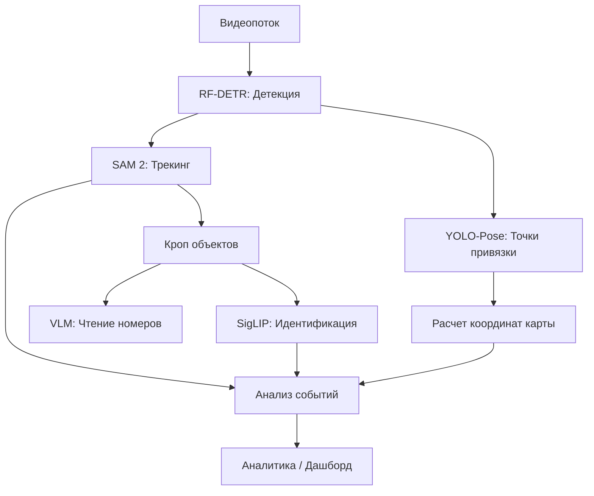

# Эталонная Архитектура Мультимодальной AI-системы

Данный документ описывает целевую архитектуру (Target Architecture) нашего проекта, основанную на лучших практиках построения сложных CV-пайплайнов (на примере баскетбольной аналитики). Мы стремимся к реализации подобного модульного подхода.

## Философия Архитектуры

**Композитный подход**: Вместо одной монолитной модели используется цепочка (pipeline) специализированных SOTA-моделей.
*   **Преимущество**: Гибкость, возможность замены компонентов, высочайшая точность на каждом этапе.
*   **Принцип**: Лучший инструмент для каждой задачи (Best-in-Class).

## Компоненты Пайплайна

### 1. Обнаружение объектов (Detection)
*   **Задача**: Идентификация ключевых объектов (персонал, техника, грузы) и событий.
*   **Технология**: **RF-DETR** (Real-Time DEtection TRansformer).
*   **Почему**: Превосходит YOLOv8/v11 по точности и устойчивости к сложному фону (DINOv2 backbone).
*   **Вход**: Кадр видео.
*   **Выход**: Bounding Boxes + Классы.

### 2. Отслеживание (Tracking & Segmentation)
*   **Задача**: Устойчивое ведение объектов при перекрытиях (окклюзиях) и сложных траекториях.
*   **Технология**: **SAM 2** (Segment Anything Model 2).
*   **Подход**: Использование детекций от RF-DETR как "промптов" для SAM 2.
*   **Преимущество**: Попиксельное отслеживание (эмбеддинги), устойчивость к исчезновению объекта из кадра.

### 3. Идентификация (Re-ID / Clustering)
*   **Задача**: Различение "свой-чужой" (например, сотрудники разных служб) без явной разметки.
*   **Технология**: **SigLIP** (Embeddings) + **UMAP** + **K-Means**.
*   **Метод**: Unsupervised кластеризация визуальных эмбеддингов одежды/техники.

### 4. Распознавание атрибутов (OCR / VLM)
*   **Задача**: Чтение бортовых номеров, ID-карт, надписей на форме.
*   **Технология**: **SmolVLM-2** (Fine-tuned) или специализированные OCR.
*   **Интеграция**: Кроп объекта -> VLM -> Текст.

### 5. Семантический анализ видео (Video QA)
*   **Задача**: Сложные запросы ("Когда появился человек без каски?"), описание сцены, объяснение событий.
*   **Технология**: **Molmo 2** (AllenAI).
*   **Почему**: Открытая VLM с поддержкой видео, трекинга и ответов на вопросы с привязкой ко времени (Grounding).
*   **Роль**: "Верхний мозг" системы, работающий поверх детекторов.

### 6. Гео-привязка (Homography)
*   **Задача**: Перенос координат с 2D-видео на 2D-карту (схему перрона/площадки).
*   **Технология**: Кастомная **YOLOv8-Pose** (Keypoints).
*   **Метод**: Детекция реперных точек (разметка) -> Расчет матрицы гомографии -> Проекция.

### 7. Анализ событий (Event Logic)
*   **Задача**: Определение сложных действий (например, "начало обслуживания", "нарушение зоны").
*   **Технология**: Логический модуль (Event Tracker).
*   **Метод**: Анализ временных рядов состояний (Finite State Machine) на основе выходов детектора.

## Схема Потока Данных

## Текущий Статус Реализации

| Компонент | Статус | Инструмент в проекте |
| :--- | :--- | :--- |
| **Detection** | ✅ Готово | `src/inference/rf_detr.py` |
| **Tracking** | ⚠️ Частично | `src/inference/sam2_demo.py` (нужен видео-пайплайн) |
| **Re-ID** | ❌ Планируется | - |
| **OCR** | ❌ Планируется | - |
| **Homography** | ❌ Планируется | - |
| **Events** | ❌ Планируется | - |

---
*Основано на архитектуре мультимодальной системы баскетбольной аналитики (2025).*

