# Эталонная Архитектура Мультимодальной AI-системы

Данный документ описывает целевую архитектуру (Target Architecture) нашего проекта, основанную на лучших практиках построения сложных CV-пайплайнов. Мы стремимся к реализации модульного подхода с интеграцией SOTA vision-language моделей.

## Философия Архитектуры

**Гибридный подход**: Быстрые специализированные детекторы + мощная VLM для семантического понимания.

```
┌─────────────────────────────────────────────────────────────────┐
│                     АРХИТЕКТУРА СИСТЕМЫ                         │
├─────────────────────────────────────────────────────────────────┤
│                                                                 │
│   Видеопоток                                                    │
│       │                                                         │
│       ▼                                                         │
│   ┌───────────────┐                                             │
│   │   RF-DETR     │  ← Быстрая детекция (real-time)            │
│   │   (Detection) │                                             │
│   └───────┬───────┘                                             │
│           │                                                     │
│           ▼                                                     │
│   ┌───────────────┐                                             │
│   │    SAM 2      │  ← Точный трекинг и сегментация            │
│   │  (Tracking)   │                                             │
│   └───────┬───────┘                                             │
│           │                                                     │
│           ▼                                                     │
│   ┌───────────────┐                                             │
│   │   Molmo 2     │  ← Семантическое понимание видео           │
│   │    (VLM)      │    (Re-ID, OCR, Events, QA)                │
│   └───────┬───────┘                                             │
│           │                                                     │
│           ▼                                                     │
│   ┌───────────────┐                                             │
│   │   Dashboard   │  ← Аналитика и алерты                      │
│   └───────────────┘                                             │
│                                                                 │
└─────────────────────────────────────────────────────────────────┘
```

**Принципы**:
*   **Best-in-Class**: Лучший инструмент для каждой задачи.
*   **Гибкость**: Возможность замены компонентов без переписывания всего пайплайна.
*   **Открытость**: Только open-source модели с прозрачными лицензиями.

## Компоненты Пайплайна

### 1. Обнаружение объектов (Detection)
*   **Задача**: Идентификация ключевых объектов (персонал, техника, грузы) и событий.
*   **Технология**: **RF-DETR** (Real-Time DEtection TRansformer).
*   **Почему**: Превосходит YOLOv8/v11 по точности и устойчивости к сложному фону (DINOv2 backbone).
*   **Вход**: Кадр видео.
*   **Выход**: Bounding Boxes + Классы.

### 2. Отслеживание (Tracking & Segmentation)
*   **Задача**: Устойчивое ведение объектов при перекрытиях (окклюзиях) и сложных траекториях.
*   **Технология**: **SAM 2** (Segment Anything Model 2).
*   **Подход**: Использование детекций от RF-DETR как "промптов" для SAM 2.
*   **Преимущество**: Попиксельное отслеживание (эмбеддинги), устойчивость к исчезновению объекта из кадра.

### 3. Семантическое понимание видео (VLM)
*   **Задача**: Ответы на сложные вопросы по видео, grounding, трекинг событий.
*   **Технология**: **Molmo 2** (Allen Institute for AI) — семейство открытых vision‑language моделей для видео и мультикадрового анализа.
*   **Почему Molmo 2**:
    - **Полноценная поддержка видео**: Модель принимает до сотни кадров или несколько изображений и возвращает "grounded" ответы.
    - **Grounded понимание**: Не просто текст, а координаты (pointing) и таймкоды событий.
    - **Производительность**: 8B модель превосходит Molmo-72B и проприетарные аналоги на ряде бенчмарков.
    - **Реалистичные размеры**: 4B и 8B версии подходят для on-prem использования (например, на RTX 5090).
    - **Полная открытость**: Опубликованы веса, датасеты (9+ млн примеров) и код без "лицензионного тумана".
*   **Возможности**:
    - **Video QA & Captioning**: Ответы на сложные вопросы ("Когда человек без жилета вошёл в зону?") и детальные описания.
    - **Pointing & Grounding**: Указание координат объектов и областей интереса.
    - **Трекинг и счёт**: Отслеживание объектов по кадрам и подсчёт редких событий.
    - **Multi-image reasoning**: Анализ и сопоставление нескольких сцен/кадров во времени.
*   **Варианты моделей**:
    | Модель | Размер | База | Примечание |
    |--------|--------|------|------------|
    | Molmo-2-4B | 4B | OLMo 2 | Быстрый, обгоняет аналогичные 7B-8B модели |
    | Molmo-2-8B | 8B | OLMo 2 | Баланс скорость/качество, SOTA для своего размера |
    | Molmo-2-O-7B | 7B | OLMo 2 | Полностью открытая база от Ai2 |
    | Molmo-2-VideoPoint-4B | 4B | - | Специализированная модель для видео-трекинга |

<<<<<<< HEAD
### 4. Распознавание атрибутов (OCR / VLM)
*   **Задача**: Чтение бортовых номеров, ID-карт, надписей на форме.
*   **Технология**: **SmolVLM-2** (Fine-tuned) или специализированные OCR.
*   **Интеграция**: Кроп объекта -> VLM -> Текст.

### 5. Семантический анализ видео (Video QA)
*   **Задача**: Сложные запросы ("Когда появился человек без каски?"), описание сцены, объяснение событий.
*   **Технология**: **Molmo 2** (AllenAI).
*   **Почему**: Открытая VLM с поддержкой видео, трекинга и ответов на вопросы с привязкой ко времени (Grounding).
*   **Роль**: "Верхний мозг" системы, работающий поверх детекторов.

### 6. Гео-привязка (Homography)
=======
### 4. Гео-привязка (Homography)
>>>>>>> 7d135406ac893704c97f4fb6a91a792e3b500557
*   **Задача**: Перенос координат с 2D-видео на 2D-карту (схему перрона/площадки).
*   **Технология**: Кастомная **YOLOv8-Pose** (Keypoints).
*   **Метод**: Детекция реперных точек (разметка) → Расчет матрицы гомографии → Проекция.

<<<<<<< HEAD
### 7. Анализ событий (Event Logic)
=======
### 5. Анализ событий (Event Logic)
>>>>>>> 7d135406ac893704c97f4fb6a91a792e3b500557
*   **Задача**: Определение сложных действий (например, "начало обслуживания", "нарушение зоны").
*   **Технология**: Гибридный подход:
    - **Molmo 2** для семантических запросов ("что произошло?")
    - **FSM** (Finite State Machine) для детерминированных правил
*   **Метод**: Комбинация VLM-ответов и логики на основе детекций.

## Схема Потока Данных

```mermaid
graph TD
    Video[Видеопоток] --> Detector[RF-DETR: Детекция]
    Detector --> Tracker[SAM 2: Трекинг]
    Tracker --> Sampler[Сэмплер кадров]
    Sampler --> VLM[Molmo 2: Понимание видео]
    VLM --> QA[Ответы на вопросы]
    VLM --> Pointing[Координаты объектов]
    VLM --> OCR[Чтение текста]
    Detector --> Keypoints[YOLO-Pose: Точки привязки]
    Keypoints --> Homography[Расчет координат карты]
    VLM --> Events[Анализ событий]
    Homography --> Events
    Events --> Dashboard[Аналитика / Дашборд]
    Events --> Alerts[Алерты в реальном времени]
```



## Интеграция Molmo 2 в пайплайн

### Сценарий 1: Real-time алерты
```
RF-DETR (каждый кадр) → триггер (человек в зоне) → 
    → сэмпл 10 кадров → Molmo 2 ("есть ли жилет?") → алерт
```

### Сценарий 2: Пост-анализ видео
```
Видеозапись → Molmo 2 ("найди все нарушения регламента") → 
    → список событий с таймкодами и координатами
```

### Сценарий 3: Интерактивный поиск
```
Оператор: "Когда топливозаправщик подъехал к борту?" →
    → Molmo 2 → таймкод + кадр с pointing
```

## Текущий Статус Реализации

| Компонент | Статус | Инструмент в проекте |
| :--- | :--- | :--- |
| **Detection** | ✅ Готово | `src/inference/rf_detr.py` |
| **Tracking** | ⚠️ Частично | `src/inference/sam2_demo.py` (нужен видео-пайплайн) |
| **VLM (Molmo 2)** | 🔜 Следующий этап | - |
| **Homography** | ❌ Планируется | - |
| **Events** | ❌ Планируется | - |
| **Dashboard** | ❌ Планируется | - |

## Roadmap интеграции Molmo 2

### Этап 1: Базовая интеграция
- [ ] Скачать Molmo-2-4B с HuggingFace
- [ ] Создать `src/inference/molmo2.py` — обёртка для инференса
- [ ] Тест на статичных изображениях (pointing, QA)

### Этап 2: Видео-пайплайн
- [ ] Интеграция с SAM 2 (передача треков как контекст)
- [ ] Сэмплирование кадров для VLM (не каждый кадр — дорого)
- [ ] Кэширование эмбеддингов видео

### Этап 3: Продакшн
- [ ] FastAPI/gRPC микросервис для Molmo 2
- [ ] Интеграция с очередью событий (Kafka/Redis)
- [ ] Дообучение на доменных данных (авиатехника, форма персонала)

## Требования к железу

| Модель | VRAM | Скорость (RTX 5090) |
|--------|------|---------------------|
| Molmo-2-4B | ~10 ГБ | ~2-3 сек/запрос |
| Molmo-2-8B | ~18 ГБ | ~4-5 сек/запрос |
| RF-DETR + SAM 2 + Molmo-2-4B | ~20 ГБ | Хватает для RTX 5090 (32 ГБ) |

---
*Архитектура основана на SOTA-практиках 2025: RF-DETR (Roboflow), SAM 2 (Meta), Molmo 2 (Allen Institute for AI).*


